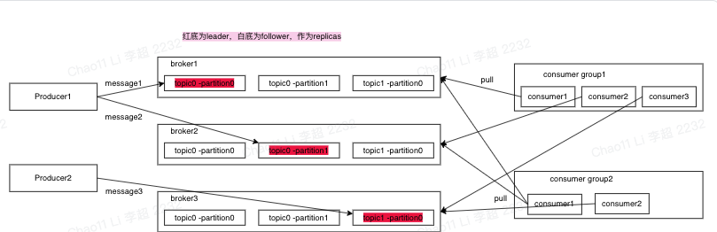
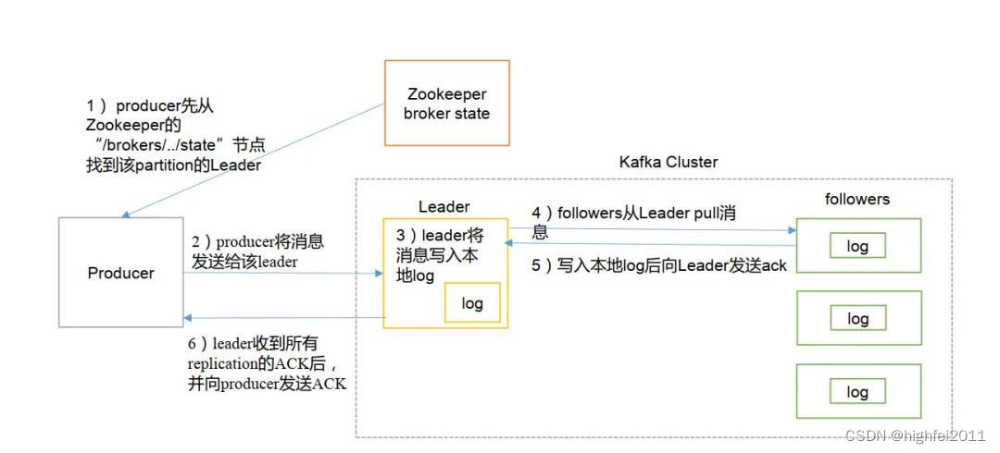

## 一、消息队列是什么
消息队列是一种进程间通信或者同一个进程中不同线程间的通信方式，主要解决异步处理、应用耦合、流量消峰等问题，实现高性能、高可用、可伸缩和最终一致性架构，是大型分布式系统不可缺少的中间件。 
**1. 异步处理**  
大部分用户并不急着立即响应处理结果，那么可以利用消息队列异步处理的特性，数据放到MQ中，用户不需要立即处理，大大缩短了系统的响应时间。如kafa用于日志收集 
另一种情况是用户数据放到mq中，由mq分发到不同的处理系统中，不同的系统进行并行处理，极大缩短用户请求处理时间。 
**2. 削峰填谷** 
类似秒杀系统，QPS瞬时增高，对系统负荷太大，这时可以利用mq以平滑的方式进行流量处理，避免流量的不规则冲击。 
**3. 解耦** 
利用MQ可以对系统间的依赖性进行解耦，降低依赖系统变更带来的影响。比如A系统需要BCD系统处理结果，如果BCD系统挂了，A系统就需要考虑是否重试等机制来保障BCD系统返回结果。
又或者接入新的系统，又需要重新修改代码。但是如果把消息放到MQ中，又不同系统各自处理，既能快速接入其他系统，又不用关系其他系统的可用性，由各自系统保障自己可用性即可。

## 二、消息队列选型
从消息队列的使用需求或消费模型来说，一般分为两种类型的设计：一种是面向流而设计的，如 Kafka；一种是面向队列去设计的，即传统意义的 Queue 数据结构，如 RabbitMQ；  
**流模型**
- 强调消息的有序，消费下游一般关注消息顺序
- 强调消费的独占，Consumer 是跟 Partition 强绑定的
- 消息的读写一般是 Batch 进行，batch ack，偏重吞吐的优化
- 消息持久化保存，支持消息回溯重放
- 典型场景：数据集成下的系统解耦；数据收集 + 后端计算

**队列模型**
- 采用无序的方式消费，消费下游一般不关心消息排序
- 采用共享的方式消费，可以通过增加 Consumer 数量来增加并发度
- 对于一条消息，多个 Consumer 中只有一个（可能是任何一个）能消费到这条消息
- 能够跟踪单条消息状态，可以随机 ACK 一条消息，偏重延迟优化
- 一般情况下，消息消费后就会被标记删除
- 典型场景：异步调用，事件通知，比如上面提到的注册时异步的发送邮件、下单时异步的发送短信

## 二、kafa架构
**kafa核心概念**
- Producer：生产者，负责将客户端生产的消息发送到 Kafka 中，可以支持消息的异步发送和批量发送；
- broker：服务代理节点，Kafka 集群中的一台服务器就是一个 broker，可以水平无限扩展，同一个 Topic 的消息可以分布在多个 broker 中；
- Consumer Group：消费者组，指的是多个消费者共同组成一个组来消费一个 Topic 中的消息。
- Consumer：消费者，通过连接到 Kafka 上来接收消息，用于相应的业务逻辑处理。 每个patition只能由同一个consumer group内的一个consumer来消费。
- topic: 从逻辑上可以认为是一个queue
- partition：一个topic可以划分多个partition，可以提升整个集群的吞吐量，一个分区在磁盘上对应一个文件夹。由于一个分区只属于一个主题，很多时候也会被叫做主题分区(Topic-Partition)。
    

**kafa写流程**
1. Producer 根据message，message是k-v结构，默认k路由算法是hash取模，然后定位到应该放到哪个partition上
2. producer 往该partition的leader节点发送消息
3. leader节点往本地磁盘写log，其他follower从leader pull同步消息
4. follower将消息写入本地磁盘log后，发送ack给leader节点
5. 当leader节点收到ISR所有节点的ack后，返回给用户ack 

  
1. 连接到 zk 集群，从zookeeper 中拿到对应的 topic 的 partition 信息和 partition 的 leader 的相关信息
2. 连接到对应的 leader 对应的 broker
3. consumer 将自己保存的 offset 发送给 leader
4. leader 根据 offset 等信息定位到 segment（索引文件 .index 和日志文件 .log ）
5. 根据索引文件中的内容，定位到日志文件中该偏移量对应的开始位置读取相应长度的数据并返回给 consumer

**Question**
1. 如何保证消息顺序消费？
> Kafka 的消费单元是 Partition，同一个 Partition 使用 offset 作为唯一标识保证顺序性，但这只是保证了在 Partition 内部的顺序性而不是 Topic 中的顺序，
因此我们需要将所有消息发往统一 Partition 才能保证消息顺序消费，那么可以在发送的时候指定 MessageKey，同一个 key 的消息会发到同一个 Partition 中。
2. 如何实现高吞吐量？性能高的原因？
> - 利用了 PageCache 缓存
> - 磁盘顺序写
> - 零拷贝技术
> - pull 拉模式
3. 
## 三、rokectmq架构

## 四、项目使用情况