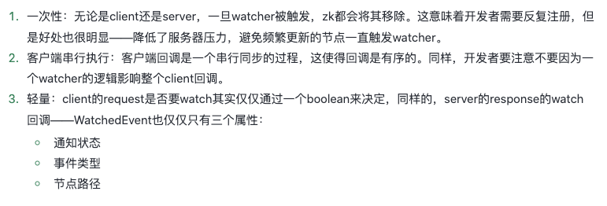

## 什么是zookeeper？
zookeeper 可以理解成文件系统 + 通知机制；
从设计模式来讲，可以理解成，负责存储和管理用户的数据，接受观察者注册， 数据发生变化负责通知观察者；
目的就是为了给分布式系统的提供协调服务；
比如：项目中用zk存放配置信息，也可以作为分布式锁，还可以用于选主，服务注册

## zookeeper数据结构
zookeeper 数据结构与文件系统非常相似，节点被称为znode。每个znode默认能存储1MB的数据。

### zookeeper 节点类型

## zooKeeper ZAB协议

## zookeeper watcher监听机制
参考：https://www.jianshu.com/p/c68b6b241943  
https://juejin.cn/post/6976771708279586823
### watcher事件通知类型
NodeCreated：节点被创建时触发。 
NodeDeleted：节点被删除时触发。 
NodeDataChanged：节点数据被修改时触发。 
NodeChildrenChanged：子节点被创建或者删除时触发。 
NONE： 该状态就是连接状态事件类型。前面四种是关于节点的事件，这种是连接的事件，具体由Watcher.Event.KeeperState枚举维护。 
### 客户端—watcher注册流程
1. 首先ZKWatchManager结构中有dataWatches、existWatches、childWatches三个map用于存放不同通知类型的watcher
2. 使用Zookeeper中的getData()/create()/delete()等方法都会触发watcher机制的创建
2. 调用ClientCnxn的queuePacket方法，此方法将请求包装成packet，并加入到outgoingQueue队列中，sendThread会消费发送队列，将请求发送到服务端；
3. 另外ClientCnxn还维护着pendingQueue，sendThread收到服务端回复时，会调用readResponse方法
4. 上一步执行最后会调用finishPacket方法，这个方法会调用watchDeregistration.register，此方法会把watcher注册到ZkWatchManager中相应的map里面

需要注意的是：
1. 客户端发送的请求中只包含是否需要注册Watcher，不会将Watcher实体发送；
2. Packet构造函数中的参数WatchRegistration是Watcher的封装体，用于服务响应成功后将Watcher保存到ZKWatchManager中； 
 

### 客户端——watcher事件通知机制实现
1. 执行queueEvent方法，此方法会执行ZkWatcherManager中的materialize方法，此方法会返回需要通知的watcher并进行移除，也就是每次watcher只会触发一次
2. 然后将待通知的watcher、通知的事件包装成event放到waitingEvent中，由eventThread去处理；
3. waitingEvent弹出的事件执行watcher.process方法

### 服务端——watcher
watchManager包含两个非常重要的数据结构：
watchTable:path-watchers，表示一个目录下可能多个消费者监听，方便通知某个路径下的watchers
watch2Paths:watcher-paths，表示同一个消费者可能监听多个路径，方便删除某个watcher监听的所有path
注意这里的watcher含义表示远程连接，

### watcher机制的特点
