# MYSQL读书笔记
[toc]   

___
### 一条sql的执行流程
1. 链接

2. 查询缓存
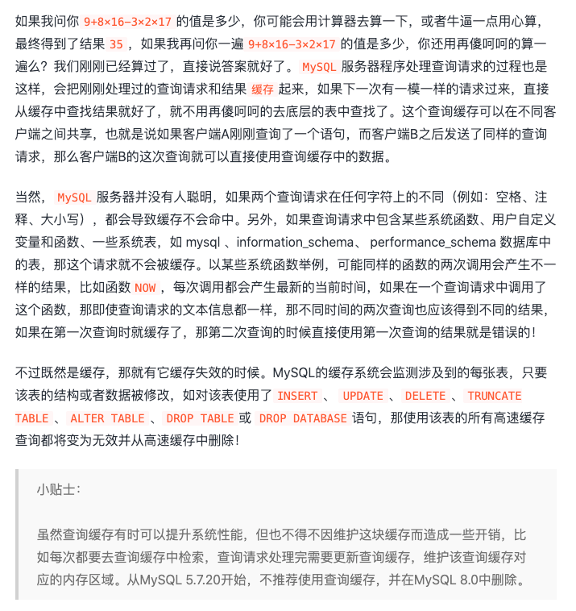
3. 语法解析
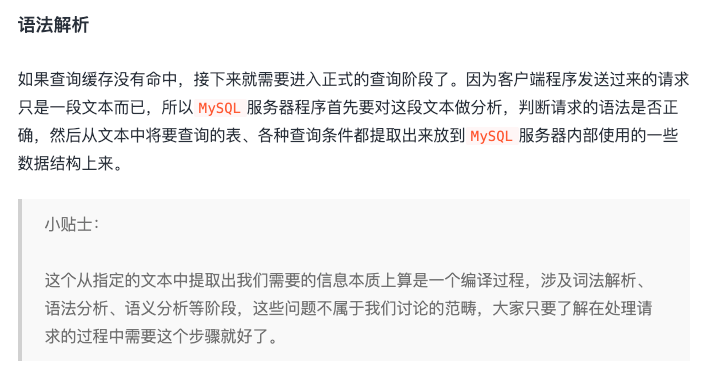
4. 查询优化
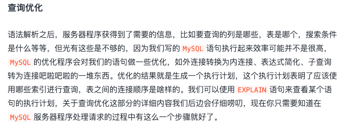
5. 存储引擎
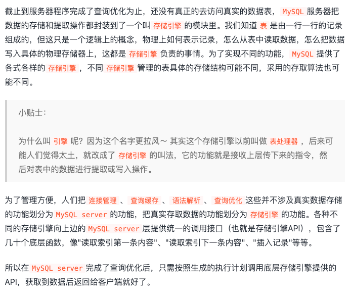

### 字符集
什么是字符集？什么是比较规则？
把字符通过映射关系转化为二进制，字符集指的是某个字符范围的编码规则。
比较规则是针对某个字符集中的字符比较大小的一种规则。
一个varchar(N)占用多大字符？
1. N表示最长多少个字符，具体几个字符按实际情况来算；
2. 另外看选的字符集，utf8是1-3字节
3. NULL值标识，如果该列有NOT NULL属性则可以没有这部分存储空间；如果设置default null 的话，需要额外占用（1/8）向上取整个字节
4. 变长字段长度记录，变长字段长度列表中只存储值为 非NULL 的列内容占用的长度，值为 NULL 的列的长度是不储存的
   最后实际占用字节 = 实际字符长度*一个字符大小+default null是否占用字节 +变长记录
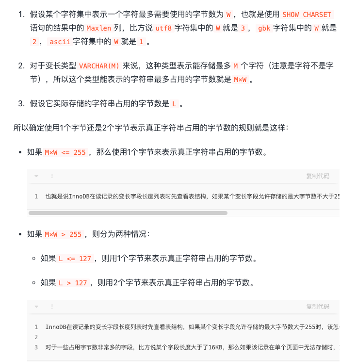
varchar类型最多存放多少个字符？
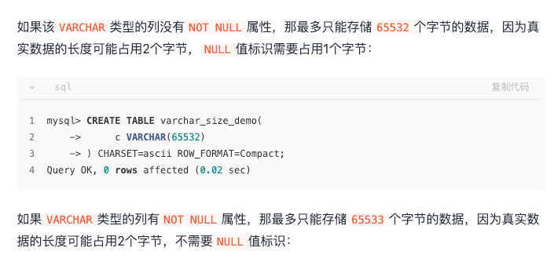
### mysql数据在硬件上是怎样存放的？
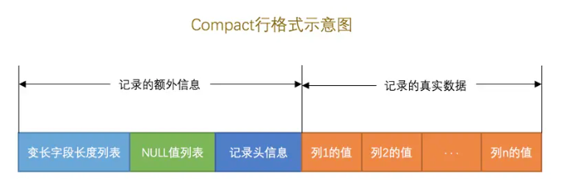

### 索引的数据结构
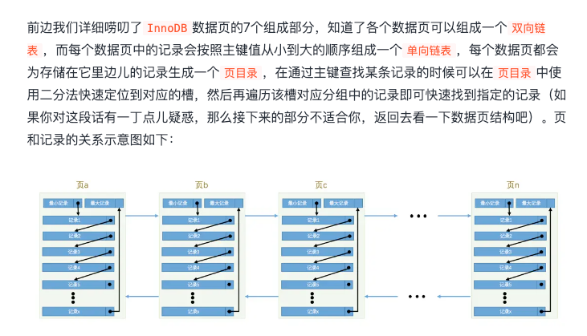
#### 聚族索引
聚族索引非叶子节点存放的是主键，叶子节点存放的是真实的数据记录
#### 二级索引
二级索引非叶子节点存放的是列，叶子节点存放的是列与主键ID
回表读的代价
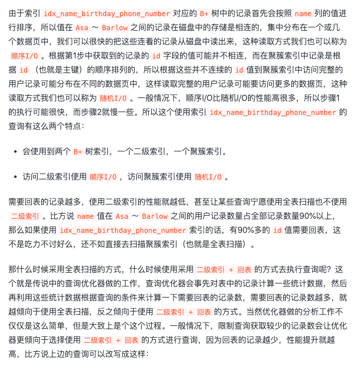
#### 联合索引
按照abc顺序排序，联合索引中从最左边连续的列
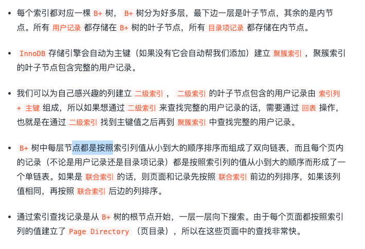
#### 如何使用索引优化，或者怎么高效使用索引？
1. 尽量覆盖索引
2. 只为用于搜索，排序，分组的列创建索引
3. 考虑列的基数，尽量为散列大的列建立索引，这样回表率低
4. 索引的类型尽量小，减少建立索引的内存消耗
5. 索引字符串值的前缀
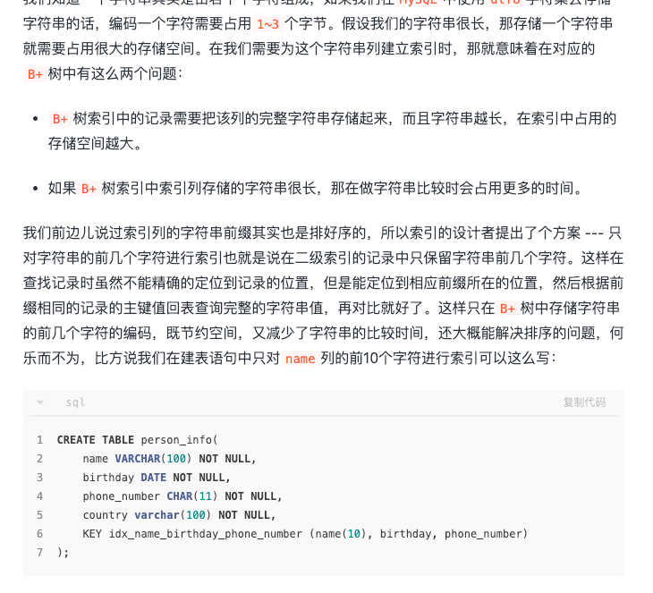
6. 让索引列在比较表达式中单独出现
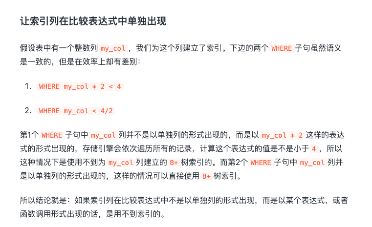
7. 主键插入顺序

8. 避免冗余和重复
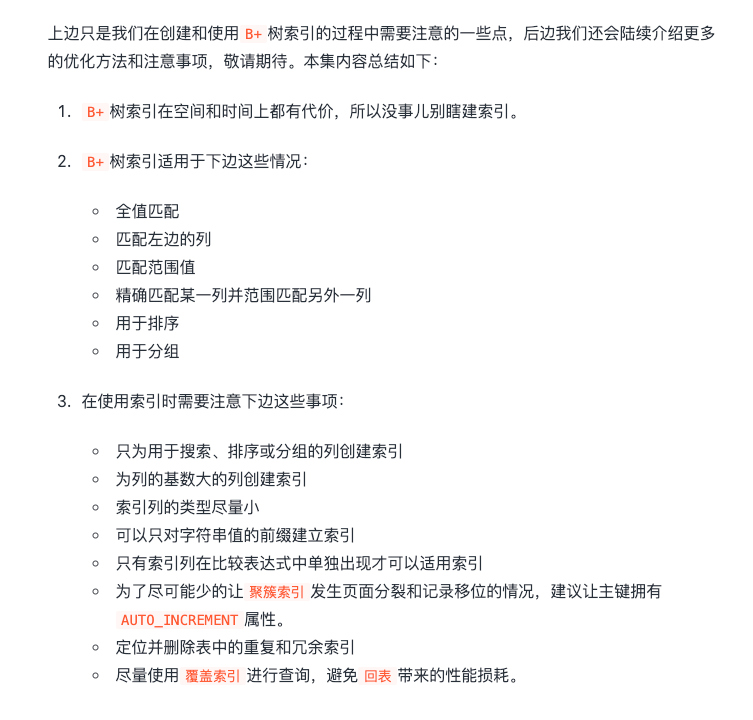
### mysql 查询优化措施
1. 根据表的统计数据，来判断使用二级索引回表代价与全表扫描哪个代价更小

### 连接
1. 内链接与外链接的根本区别，就是在驱动表中的记录不符合ON子句中的连接条件时不会把该记录加入到最后的结果集
2. 内连接的几种形式：

3. 链接的原理
   1. 循环嵌套：也就是多层for循环 
      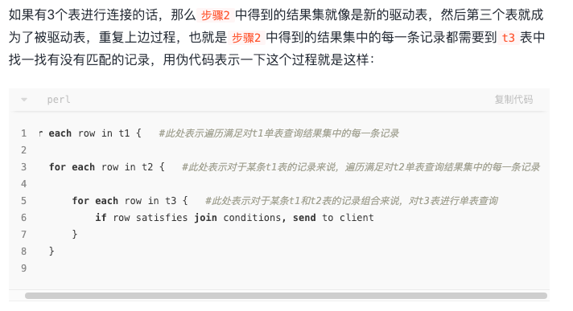
   2. 使用索引加快连接速度，被驱动表可以使用索引加快查询速度
   3. 基于块的循环连接 
   

### count(*)的过程
1. MYIAM 引擎会记录具体的行数
2. INNODB 记录的行数不准确，会选择一个最小树的进行遍历
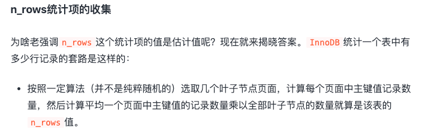

### innodb收集数据的方式

### explain 
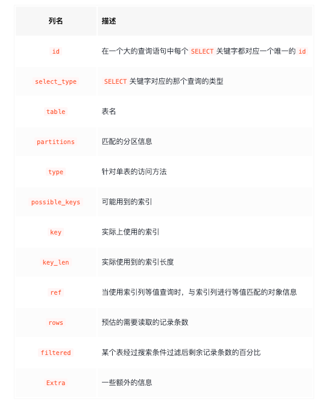
1. id 表示是不是一个查询语句，如果是链接查询，前出现的是驱动表，后出现的是被驱动表
2. select_type: 看查询是简单查询，还是主查询，还是子查询
3. type：我们前边说过执行计划的一条记录就代表着MySQL对某个表的执行查询时的访问方法；
         const表示对主键/唯一二级索引列与常数匹配；
         ref表示普通二级索引与常数匹配
         fulltext 表示全文搜索
         index 表示能够使用索引覆盖
         range 表示范围查询
         all 全文扫描
4. filtered: 可以理解为使用索引后优化的效果
5. extra: 可以通过这些信息查看mysql具体怎么进行的优化，比如是否使用索引下推，join buffer，是否使用临时表等等

### INNODB 加锁
#### 加锁的考虑因素？
1. 事务的隔离级别，innodb在（可重复读）隔离级别下也解决了幻读
2. 查询使用的索引类型
3. 查询语句是精准匹配还是范围匹配

