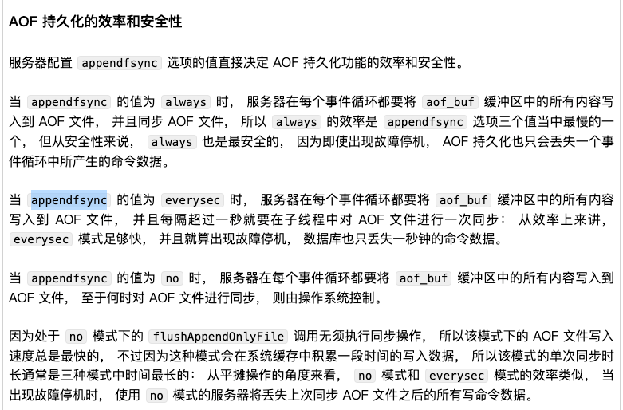

# 数据结构
# 线程模型

# RDB 文件与AOF 文件区别？
## RDB文件
RDB文件是数据快照，fork一个子进程，让子进程来执行磁盘IO操作完成RDB文件持久化；
如果数据文件特别大的话可能会影响主线程服务，造成服务延迟卡顿；
优点：一般来讲文件比较小，适合做冷备，能快速启动一个redis服务节点
缺点：文件同步时间间隔长，可能造成数据丢失的比较多；
## AOF文件
AOF文件是存放的写命令，通过appendfsync参数可以设置缓存里的写命令何时落盘，也就是可以通过设置减小数据丢失的概率；

优点是：数据比较全，适合做rollback；
缺点：开启AOF会影响节点一定的写速度

# redis 主从节点同步的过程
## 什么是全量同步？
## 什么是增量同步

